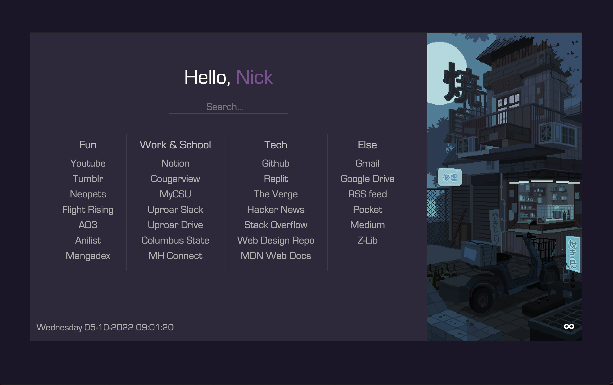

homepage
========

### Live Demo: <a href="https://n1999ck.github.io/homepage/">Demo</a>

### DuckDuckGo: <a href="https://duckduckgo.com/">Link</a>

### Default Home

This is a fork of djordjeivanovic9's fork of RamenMaestro's [startpage](https://github.com/RamenMaestro/startpage) with a image scroll option, larger option size, added favicon and search bar.

This fork is mostly small changes.

## Credits
Images used in the sidebar are by background artist [Waneella](https://twitter.com/waneella_).\
Search bar powered by DuckDuckGo. 